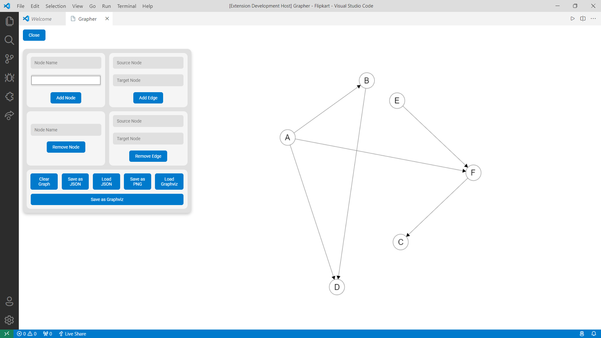

# Grapher README

This is the README for your extension "evaluator". After writing up a brief description, we recommend including the following sections.

## Features
- Graph: Create and visualize graphs.
- Add Nodes: Add nodes to the graph.
- Add Edges: Connect nodes with edges.
- Remove Nodes: Remove nodes from the graph.
- Remove Edges: Remove edges from the graph.
- Save as image: Save the graph as an image file.
- Save as json: Save the graph in JSON format.
- Load from json: Load a graph from a JSON file.
- Save in graphviz format: Save the graph in Graphviz format.
- Load from graphviz format: Load a graph from a Graphviz file.
- Save in dot format: Save the graph in DOT format.
- Load from dot format: Load a graph from a DOT file.

## Requirements

No requirements.

## Extension Settings

To use the extension, open the command palette and type `Grapher`. You will see the following options:
- `Grapher: Start`: Start the grapher.

And then you can see the window opened with the grapher.

## Known Issues

No known issues.

## Release Notes

### 1.0.0

Initial release of Grapher.

**Enjoy!**
